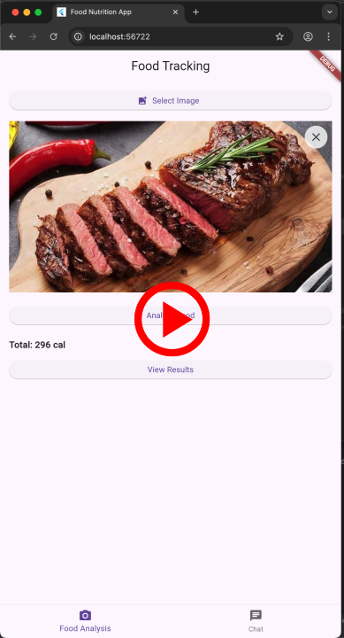

# Food Tracking Web App with GPT

A Flutter Web application that lets users capture meal photos for AI-powered nutrition analysis and includes real-time chat functionality between admin and customers/friends.

## User Stories

The following **required** functionality is completed:

### Food Tracking
- [ ] User can **capture a photo via camera** (only file upload implemented)
- [x] User can **upload from device** 
- [x] User can **tap "Analyze" button** to trigger GPT Vision API call
- [x] User can **send image to GPT-4o** API
- [x] User can **receive structured JSON response** with detected food items and total nutrients
- [x] User can **view detected food items** with portion sizes (grams) and macros
- [x] User can **see nutritional summary** with total calories, protein, carbs, fat
- [x] User can **see loading states** during API processing
- [x] User can **view error messages** when operations fail

### Chat Feature
- [x] User can **access simple two-way chat** between admin and customers/friends
- [x] User can **send and receive messages** with timestamps
- [x] User can **visually distinguish admin and user messages**
- [x] User can **persist messages in memory** during session (no backend storage)

### Technical Requirements
- [x] **Flutter 3.22+** targeting Web (using Flutter 3.32.8)
- [x] **Startable in VS Code** with `flutter run -d chrome`
- [x] **State management** implemented (Provider pattern)
- [x] **Default widgets** used (no UI design focus)

### Pages
- [x] **Food Tracking Page** (photo input → results)
- [x] **Results Page** (detailed nutrients + summary)
- [x] **Chat Page** (admin ↔ customer/friend messaging)

### Acceptance Criteria
- [x] App runs in Chrome via Flutter
- [x] Photo input → API/Mock call → Valid JSON parsing → Display of nutrients
- [x] Chat page works with at least one admin and one user role
- [x] Loading states & error handling visible
- [x] README explains setup, API key placeholder, and example image

## Bonus Points

The following **bonus** features from the challenge:

- [ ] Editable portions with recalculated totals
- [ ] Multiple chat rooms or persistent message history

## Notes

Challenges encountered while building the app:

- **API Integration**: Setting up GPT-4 Vision API with proper image formatting and response parsing
- **State Management**: Coordinating between food analysis and chat features using Provider pattern
- **Web Compatibility**: Ensuring camera/file upload works seamlessly in Flutter Web
- **Real-time Chat**: Implementing session-based messaging without backend persistence
- **Code Generation**: Managing JSON serialization with build_runner for complex nested models

## Video Walkthrough

Here's a walkthrough of implemented user stories:

[](https://youtu.be/tN9bW3hQ4g8?si=GO3b_jR9YewA-Wah)

**Click the image above to watch the full video walkthrough on YouTube**

## Setup Instructions

### Prerequisites
- Flutter 3.22+ (currently using Flutter 3.8.1+)
- A modern web browser (Chrome recommended)

### Environment Configuration
1. Copy the environment template:
   ```bash
   cp .env_sample .env
   ```

2. Update the `.env` file with your OpenAI API key:
   ```
   OPENAI_API_KEY=your_actual_openai_api_key_here
   ```

### Installation & Running
1. Install dependencies:
   ```bash
   flutter pub get
   ```

2. Run the app in Chrome:
   ```bash
   flutter run -d chrome
   ```

## Open-source libraries used

- [Flutter](https://flutter.dev/) - UI framework
- [Provider](https://pub.dev/packages/provider) - State management
- [Dio](https://pub.dev/packages/dio) - HTTP client for API calls
- [GetIt](https://pub.dev/packages/get_it) - Dependency injection
- [JSON Annotation](https://pub.dev/packages/json_annotation) - JSON serialization
- [Flutter EasyLoading](https://pub.dev/packages/flutter_easyloading) - Loading indicators
- [Logger](https://pub.dev/packages/logger) - Logging utility
- [Flutter DotEnv](https://pub.dev/packages/flutter_dotenv) - Environment variables

## License

    Copyright 2024 [Your Name]

    Licensed under the Apache License, Version 2.0 (the "License");
    you may not use this file except in compliance with the License.
    You may obtain a copy of the License at

        http://www.apache.org/licenses/LICENSE-2.0

    Unless required by applicable law or agreed to in writing, software
    distributed under the License is distributed on an "AS IS" BASIS,
    WITHOUT WARRANTIES OR CONDITIONS OF ANY KIND, either express or implied.
    See the License for the specific language governing permissions and
    limitations under the License.
